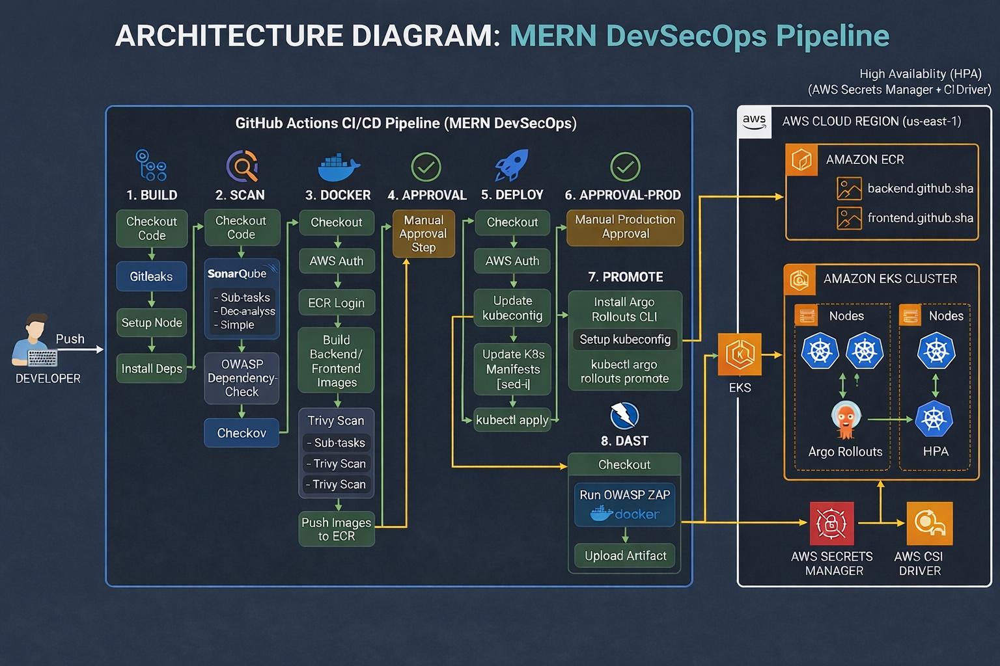

# 🚀 MERN App Deployment on AWS EKS Using DevSecOps Practices

### 🔵🟢 Blue-Green Deployment + 🔐 Security + ⚙️ CI/CD Automation

---

## 📌 Overview

This project demonstrates a **complete end-to-end DevSecOps implementation** for deploying a MERN  application on AWS.

It covers:

* ☁️ Infrastructure setup using AWS (EC2, ECR, EKS)
* 🐳 Secure containerization with Docker
* 🔵🟢 Blue-Green deployment using Argo Rollouts
* 🔐 Advanced security practices (SAST, DAST, IaC scanning)
* 🔐 Uses **AWS Secrets Manager + CSI Driver** for secure secret handling
* 🚀 Fully automated CI/CD pipeline using GitHub Actions
* 🌐 Production-grade exposure using AWS ALB Ingress

---

## 🧾 Description

This project is designed to simulate a **real-world production DevSecOps pipeline** used in modern cloud-native applications.

Key highlights:

* Uses **EKS (Kubernetes)** for container orchestration
* Implements **Argo Rollouts** for zero-downtime deployments
* Integrates **multi-layer security scanning**:

  * Code (SAST)
  * Dependencies (SCA)
  * Containers
  * Kubernetes manifests
  * Runtime (DAST)
* Uses **AWS Secrets Manager + CSI Driver** for secure secret handling
* Implements **HPA + Network Policies** for scalability and security
* Uses **ALB Ingress Controller** for external traffic routing

👉 Goal: Build a **secure, automated, scalable, and production-ready deployment system**

---
<p align="center">
  
</p>


## 🎯 Key Features

* 🔵🟢 Blue-Green Deployment (Zero Downtime)
* 🔁 Auto Rollback using Prometheus metrics
* 🔐 End-to-End DevSecOps Pipeline
* 🌐 Public Access via ALB (HTTPS + Routing)
* 📈 Auto Scaling with HPA
* 🔒 Zero Trust Networking (Network Policies)
* 🔑 Secure Secret Management (AWS Secrets Manager)

---

## ☁️ Step By Step Implementation 

### 🔹 Launch AWS EC2 Instance

* Instance Type: `t3.medium`
* OS: Ubuntu 22.04 LTS
* Storage: 20 GB
* Security Group:

  * Port `22` – SSH
  * Port `80`, `443` – Application
  * Port `9000` – SonarQube
  * Port `3100` - Argo-rollout

Connect to EC2:

```bash
ssh ubuntu@<EC2_PUBLIC_IP>
```

<p align="center">
  
</p>
---

### 🔹 IAM User & Permissions

Create an IAM user with **programmatic access** and attach:

* AmazonECRFullAccess
* AmazonEKSClusterPolicy
* AmazonEKSWorkerNodePolicy
* AmazonEC2ContainerRegistryFullAccess
* AmazonEC2FullAccess

### 🔹 Install AWS CLI

```bash
curl "https://awscli.amazonaws.com/awscli-exe-linux-x86_64.zip" -o awscliv2.zip
unzip awscliv2.zip
sudo ./aws/install
```
---
### 🔹 Configure AWS CLI

```bash
aws configure
```
* Provide Access Key
* Secret Key
* Region

---
### 🔹 Install Docker Engine

```bash
sudo apt update
sudo apt install docker.io -y
sudo systemctl start docker
sudo systemctl enable docker
```
---

### 🔹 Create ECR Repositories

```bash
aws ecr create-repository --repository-name frontend
aws ecr create-repository --repository-name backend
```

<p align="center">
  
</p>

### 🔹 Authenticate Docker to ECR

```bash
aws ecr get-login-password --region ap-south-1 \
| docker login --username AWS --password-stdin <ECR_REGISTRY>
```

---
## Dockerfile
- 🔗 [Backend Dockerfile](/quickChat/server/Dockerfile)
- 🔗 [frontend Dockerfile](/quickChat/client/Dockerfile)

* Multi-stage builds (optimized image size)
* Alpine base images (lightweight)
* Non-root user (security)
---
## 🧱 Docker Image Build (Frontend & Backend)

### 🔹 Build Backend Image

```bash
docker build -t backend ./server
```

### 🔹 Build Frontend Image

```bash
docker build -t frontend ./client
```
---
### 🔹 Tag Images for ECR

```bash
docker tag backend:latest <ECR_REGISTRY>/backend:latest
docker tag frontend:latest <ECR_REGISTRY>/frontend:latest
```

---

## 🚀 Push Docker Images to ECR

```bash
docker push <ECR_REGISTRY>/backend:latest
docker push <ECR_REGISTRY>/frontend:latest
```

---
## ☸️ Amazon EKS Cluster Setup

### 🔹 Install eksctl

```bash
curl -s --location "https://github.com/weaveworks/eksctl/releases/latest/download/eksctl_$(uname -s)_amd64.tar.gz" | tar xz
sudo mv eksctl /usr/local/bin
```

### 🔹 Create EKS Cluster

```bash
eksctl create cluster \
--name mern-eks \
--region ap-south-1 \
--nodegroup-name workers \
--node-type t3.medium \
--nodes 2
```

---
<p align="center">
  
</p>

### Associate IAM OIDC Provider

```bash
eksctl utils associate-iam-oidc-provider \
--region ap-south-1 \
--cluster mern-eks \
--approve
```

## 🔑 Kubernetes Configuration

### 🔹 Update kubeconfig

```bash
aws eks update-kubeconfig \
--region ap-south-1 \
--name mern-eks
```

### 🔹 Create Namespace

```bash
kubectl create namespace mern-prod
```
---

## 🔵🟢 Blue-Green Deployment using Argo Rollouts (with Auto Rollback)

## 📌 Overview

Implement the **Blue-Green Deployment strategy** using **Argo Rollouts** in Kubernetes, along with an **automatic rollback mechanism** based on application health metrics.

The setup ensures:

* Zero downtime deployments
* Safe release of new versions
* Automatic rollback if the new version fails

---

## ⚙️ Argo Rollouts Setup

* Argo Rollouts is installed in the cluster using Kubernetes manifests

* Apply Argo Rollouts Controller

```bash
kubectl apply -n argo-rollouts -f https://github.com/argoproj/argo-rollouts/releases/latest/download/install.yaml
```

* Verify Installation
```bash
kubectl get pods -n argo-rollouts
```

* Port Forward UI
```bash
kubectl port-forward svc/argo-rollouts-dashboard -n argo-rollouts 3100:3100
```
### Features Used

* Rollout resource (instead of Deployment)
* Blue-Green deployment strategy
* Manual promotion control
* Integration with Prometheus for analysis

---

## 🔵🟢 Blue-Green Deployment Strategy

### Rollout Configuration

```yaml
strategy:
  blueGreen:
    activeService: frontend-service
    previewService: frontend-green-service
    autoPromotionEnabled: false
    prePromotionAnalysis:
      templates:
        - templateName: frontend-rollback
```
## Rollout Resources
- 🔗 [frontend-rollout.yaml](/quickChat/k8/frontend/frontend-rollout.yaml)
- 🔗 [backend-rollout.yaml](/quickChat/k8/backend/backend-rollout.yaml)


### Explanation

* **activeService** → Serves live production traffic
* **previewService** → Routes traffic to new version for testing
* **autoPromotionEnabled: false** → Manual approval required before switching traffic
* **prePromotionAnalysis** → Runs health checks before promoting new version

---

## 🔄 Deployment Flow

1. New version deployed to **preview environment**
2. Traffic is not immediately shifted
3. Metrics are evaluated using AnalysisTemplate
4. If successful → manually promote to production
5. If failed → automatic rollback triggered

---

## 🔁 Auto Rollback using AnalysisTemplate

### Purpose

Automatically detect failures in the new version and rollback to the stable version.

### AnalysisTemplate Configuration

- 🔗 [AnalysisTemplate.yaml](/quickChat/k8/backend/auto-rollback.yaml)
---

## 📊 Metrics-Based Validation

### Metric Used: Success Rate

* Calculates percentage of successful HTTP requests (2xx)
* Compared against total requests

### Conditions

* ✅ Success → ≥ 95% success rate
* ❌ Failure → < 95% success rate

### Evaluation

* Checked every **30 seconds**
* Evaluated **3 times before decision**

---

## 🔁 Rollback Mechanism

* If failure condition is met:

  * Rollout is automatically aborted
  * Traffic remains on stable (blue) version
* No manual intervention required
---

## 📈 Horizontal Pod Autoscaler (HPA)

To ensure **high availability and scalability**, HPA is implemented for the application.

### Features

* Automatically scales pods based on CPU utilization
* Handles traffic spikes efficiently
* Improves application reliability

### HPA YAML

- 🔗 [Backend-hpa.yaml](/quickChat/k8/backend/backend-hpa.yaml)
- 🔗 [frontend-hpa.yaml](/quickChat/k8/backend/frontend-hpa.yaml)
### Apply HPA

```bash
kubectl apply -f hpa.yaml
```

---

## 🔐 Network Policies (Frontend → Backend Only)

To enhance **security inside the cluster**, Network Policies are configured to allow only **frontend-to-backend communication**.

### Features

* Restricts unwanted traffic
* Implements zero-trust networking
* Only frontend pods can access backend pods

### Network Policy YAML
- 🔗 [Network-Policy.yaml](/quickChat/k8/backend/network-policy.yaml)
### Apply Network Policy

```bash
kubectl apply -f network-policy.yaml
```
---
## 🔐 Secure Secret Management using AWS Secrets Manager + CSI Driver (Kubernetes)

### 📌 Overview

Kubernetes native secrets are **not fully secure** (base64 encoded, not encrypted by default in etcd).
To enhance security, this project uses:

👉 **AWS Secrets Manager + CSI Driver** to securely inject secrets into pods.

---

## 🏗️ Workflow

### 1. Store secrets in AWS Secrets Manager
### 2. Create IAM Policy for accessing secrets
### 3. Attach policy to IAM Role
### 4. Create Kubernetes Service Account
- 🔗 [Service-Account.yaml](/quickChat/k8/backend/service-account.yaml)

### 5. Attach IAM Role to Service Account (IRSA)
### 6. Install CSI Driver + AWS Provider

```bash id="s4a"
kubectl apply -f https://raw.githubusercontent.com/kubernetes-sigs/secrets-store-csi-driver/main/deploy/rbac-secretproviderclass.yaml
```

```bash id="s5a"
kubectl apply -f https://raw.githubusercontent.com/aws/secrets-store-csi-driver-provider-aws/main/deployment/aws-provider-installer.yaml
```

### 7. Create SecretProviderClass

* SecretProviderClass is a Kubernetes custom resource that acts as a bridge/configuration layer between:

* 🟦 Kubernetes (your pod)
* ☁️ External secret store (AWS Secrets Manager)

* 👉 It tells the CSI Driver:

* Which secrets to fetch
* From where (AWS)
* How to mount them inside the pod
- 🔗 [service-provide-class.yaml](/quickChat/k8/backend/service-account.yaml)

### 8. Mount secrets inside Pod using volumes

```yaml id="s7a"
spec:
  serviceAccountName: secrets-sa

  containers:
    - name: backend
      image: <your-image>

      volumeMounts:
        - name: secrets-store
          mountPath: "/mnt/secrets"
          readOnly: true

  volumes:
    - name: secrets-store
      csi:
        driver: secrets-store.csi.k8s.io
        readOnly: true
        volumeAttributes:
          secretProviderClass: "mern-secret-provider"
```
---
## 🌐 Exposing Application using Ingress (ALB Controller)

## 📌 Problem Statement

By default, Kubernetes services are **not accessible outside the cluster**:

* `ClusterIP` → Internal communication only
* `NodePort` → Limited and not production-friendly
* No built-in HTTPS, routing, or load balancing

👉 This creates problems:

* ❌ Cannot access app from internet
* ❌ No path-based routing (frontend/backend separation)
* ❌ No SSL (HTTPS) support

---

## ✅ Solution

We solve this using:

* **Kubernetes Ingress** → Defines routing rules
* **AWS ALB Ingress Controller** → Creates and manages AWS Load Balancer

👉 Result:

* 🌐 Public access to app
* 🔀 Path-based routing
* 🔒 HTTPS support
* ⚖️ Managed load balancing

---

## 🏗️ Architecture Flow

```bash id="r9y7cx"
User → ALB (Ingress) → Services → Pods → Application
```

### Flow Explanation

1. User hits ALB DNS URL
2. ALB checks Ingress rules
3. Routes request:

   * `/` → Frontend service
   * `/api` → Backend service
4. Service forwards to pods
5. Pods serve application response

---

## ⚙️ Components & How They Work

### 1. Ingress

* Acts as **entry point** for external traffic
* Defines routing rules (path/domain based)

### 2. ALB Ingress Controller

* Watches Ingress resources
* Automatically:

  * Creates AWS ALB
  * Configures listeners (HTTP/HTTPS)
  * Applies routing rules

### 3. AWS ALB (Application Load Balancer)

* Handles:

  * Traffic distribution
  * SSL termination (HTTPS)
  * High availability

### 4. Services

* Bridge between Ingress and Pods
* Routes traffic to correct application


---

## 📄 Ingress Configuration (Path-Based Routing)

* Define Ingress Rules
* Configure HTTPS-based Ingress
* Implement path-based routing:
* / → Frontend Service
* /api → Backend Service
---

## 🚀 Apply Ingress

- 🔗 [ingress.yaml](/quickChat/k8/ingress/ingress.yaml)

```bash id="w7jz0h"
kubectl apply -f ingress.yaml
```

---
### 5. Install ALB Controller using Helm (Use IRSA)

```bash id="u2n4wz"
helm repo add eks https://aws.github.io/eks-charts
helm repo update

helm install aws-load-balancer-controller eks/aws-load-balancer-controller \
  -n kube-system \
  --set clusterName=mern-prod \
  --set serviceAccount.create=false \
  --set serviceAccount.name=aws-load-balancer-controller
```
---

## 🔍 Get ALB DNS

```bash id="2r6b1x"
kubectl get ingress -n mern-prod
```

<p align="center">
  
</p>

---
<p align="center">
  
</p>

---

## 🔐🚀 DevSecOps CI/CD Pipeline using GitHub Actions

Pipeline location:

### CI/CD Pipeline
- 🔗 [GitHub Actions Workflow](.github/workflows/devsecops-cicd.yaml)

---

### 📌 Problem Statement

After deploying the application on Kubernetes:

* ❌ Deployment is manual
* ❌ No security checks before release
* ❌ Risk of pushing vulnerable code to production
* ❌ No automated image build & deployment

---

## ✅ Solution

We implemented a **DevSecOps pipeline using GitHub Actions** that:

* ⚙️ Automates build, scan, and deployment
* 🔐 Integrates security at every stage
* 🚀 Deploys directly to EKS using Argo Rollouts
* 🔁 Ensures safe promotion using approvals

---

## 🏗️ 🔥 Complete Pipeline Flow

```id="flow-devsecops-advanced"
Developer Push (main branch)
        ↓
📦 Build Stage
  - Checkout Code
  - Gitleaks Scan (Secrets Detection)
  - Install Dependencies
        ↓
🔍 SAST & Security Scan Stage
  - SonarQube Scan (Code Quality + Bugs)
  - Quality Gate Validation (Fail if bad code)
  - OWASP Dependency Check (Vulnerable libs)
  - Checkov Scan (K8s Security)
        ↓
🐳 Docker Build & Image Security
  - Build Frontend & Backend Images
  - Trivy Scan (Container vulnerabilities)
  - Push Images to AWS ECR
        ↓
🛑 Manual Approval (Pre-Deploy)
        ↓
🚀 Deploy to EKS (Preview Environment)
  - Update Rollout Image Tags
  - Apply Kubernetes Manifests
  - Deploy using Argo Rollouts (Blue-Green)
        ↓
🛑 Production Approval Gate
        ↓
🔵🟢 Promote to Production
  - Argo Rollouts Promote Command
  - Traffic Shift (Preview → Active)
        ↓
🛡️ DAST (Runtime Security Testing)
  - OWASP ZAP Scan on Live ALB URL
  - Generate Security Report
        ↓
📊 Artifacts & Reports Stored
        ↓
✅ Secure Production Release
```

---

## ⚙️ Pipeline Stages & Working

### 1️⃣ Build Stage

* Checkout code
* Run **Gitleaks** → Detect secrets in code
* Install dependencies

👉 ❌ Pipeline fails if secrets found

---

### 2️⃣ Security Scan Stage (Shift Left Security)

* 🔍 **SonarQube** → Code quality + SAST
* 🛡️ **Quality Gate** → Blocks bad code
* 📦 **OWASP Dependency Check** → Vulnerable libraries
* ☸️ **Checkov** → Kubernetes manifest security

👉 ❌ Stops pipeline on vulnerabilities

---
## 🔍 SonarQube Setup (SAST)

### 🔹 Run SonarQube Using Docker

```bash
docker run -d \
--name sonarqube \
-p 9000:9000 \
sonarqube:lts
```
Access:

```
http://<EC2_PUBLIC_IP>:9000
```

### 🔹 Configure SonarQube

* Create project
* Generate token
* Store in GitHub Secrets:

  * `SONAR_TOKEN`
  * `SONAR_HOST_URL`

---
### 🔹 SonarQube Report MERN App Code Testing

<p align="center">
  
</p>

### 3️⃣ Docker + Image Security

* Build frontend & backend images
* Scan using **Trivy**:

  * Detect HIGH / CRITICAL vulnerabilities
* Push only secure images to ECR

---

### 4️⃣ Approval Gate (Pre-Deployment)

* Manual approval required
* Prevents accidental deployment

---

### 5️⃣ Deployment (Preview Environment)

* Update image tags dynamically
* Connect to EKS cluster
* Deploy using **Argo Rollouts (Blue-Green)**

👉 New version runs in **preview environment**
👉 Public See **Old Version**
---

### 6️⃣ Production Approval Gate

* Second approval before public release
* Ensures business-level validation

---

### 7️⃣ Promotion (Traffic Shift)

```bash id="cmd-promote"
kubectl argo rollouts promote backend
kubectl argo rollouts promote frontend
```

👉 Traffic switches:

* Preview → Production
* Public See New Version
* Zero downtime deployment

---

### 8️⃣ DAST (Runtime Security)

* Run **OWASP ZAP** on live app

```bash id="cmd-zap"
docker run --rm \
  -v $(pwd):/zap/wrk/:rw \
  ghcr.io/zaproxy/zaproxy:stable \
  zap-full-scan.py \
  -t https://<alb-dns> \
  -r zap-report.html
```

* Detect runtime vulnerabilities
* Generate report artifact

---

## 🔧 Key Security Tools

| Tool                   | Type           | Purpose                  |
| ---------------------- | -------------- | ------------------------ |
| Gitleaks               | Secrets Scan   | Detect hardcoded secrets |
| SonarQube              | SAST           | Code vulnerabilities     |
| OWASP Dependency Check | SCA            | Library vulnerabilities  |
| Checkov                | IaC Scan       | K8s security             |
| Trivy                  | Container Scan | Image vulnerabilities    |
| OWASP ZAP              | DAST           | Runtime security         |

---

## 🎯 Key Benefits

* 🔐 Security at every stage (Shift Left + Right)
* 🚀 Fully automated CI/CD pipeline
* 🛑 Prevents insecure deployments
* 🔁 Controlled releases with approvals
* 📊 Continuous validation (pre + post deployment)

---

## 📌 Conclusion

This pipeline delivers:

* **End-to-end automation**
* **Strong DevSecOps practices**
* **Safe production deployments using Blue-Green strategy**

👉 Result: A **robust, secure, production-ready CI/CD pipeline** used in real-world DevSecOps environments.

---
* We Have successfully Completed The MERN Application Deployment on AWS EKS with GitHub Actions (Blue-Green + DevSecOps). Thank you for Visiting my Project!!

## 🧑‍💻 Author

**Akash Kayande**
DevOps Engineer | AWS | Kubernetes | DevSecOps | CI/CD | GitOps

---

## ⭐ Support

If you found this project useful:

* ⭐ Star the repository
* 🍴 Fork and experiment
* 🐛 Raise issues or improvements