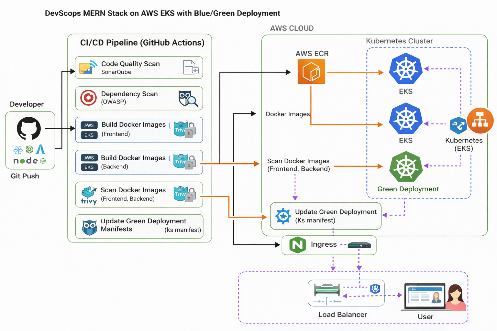
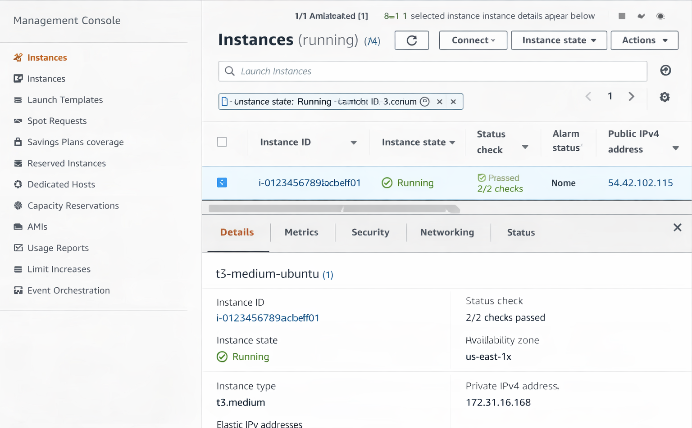
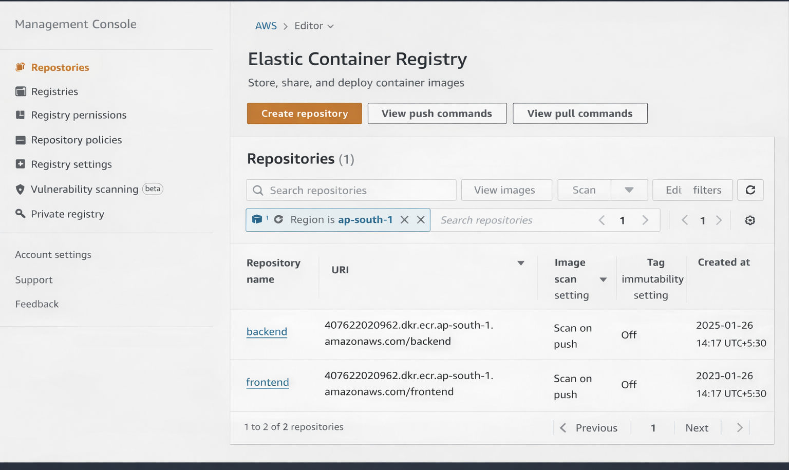
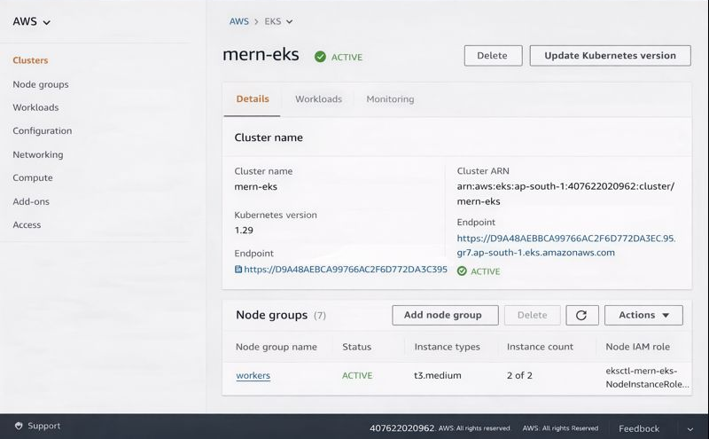
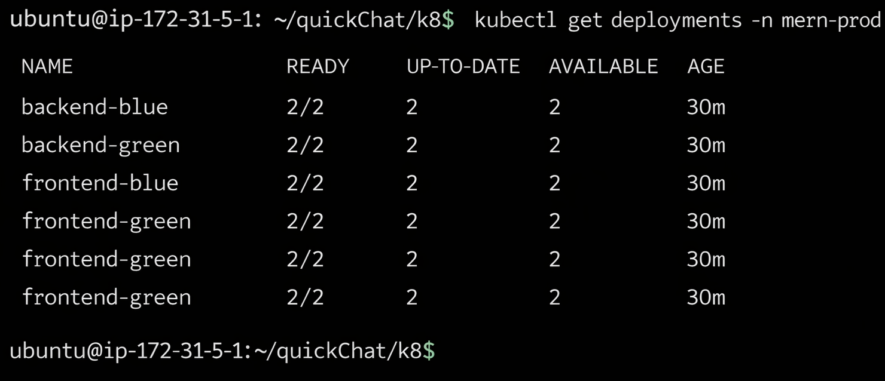
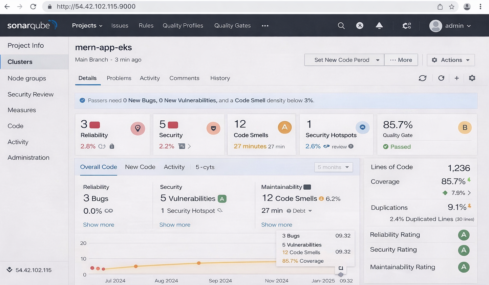
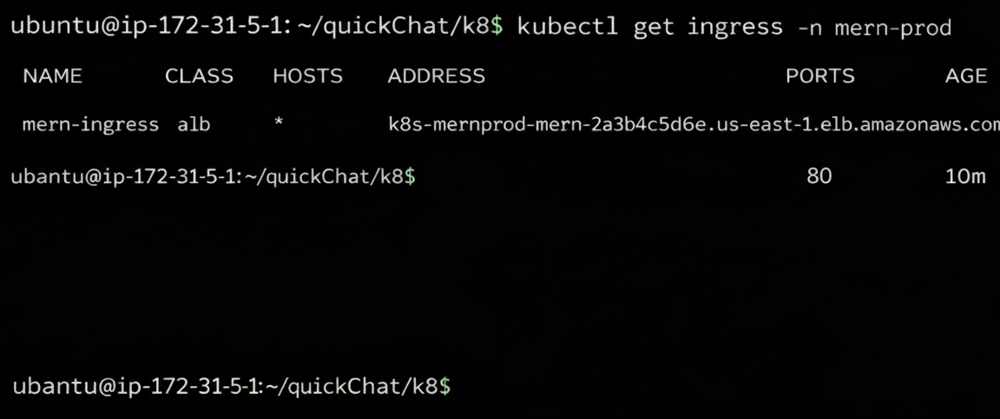
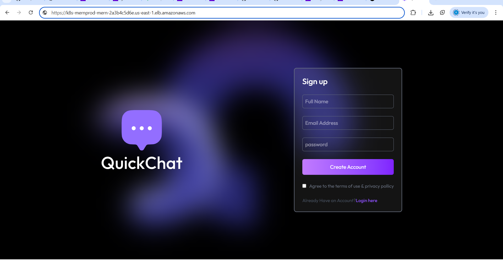

## MERN Application Deployment on AWS EKS with GitHub Actions (Blue-Green + DevSecOps)

---

## 📌 Project Title

**End-to-End DevSecOps Pipeline for MERN Application Deployment on AWS EKS**

---

## 📖 Project Description

This project demonstrates a **complete end-to-end DevSecOps implementation** where a **MERN stack application** is containerized, secured, and deployed on an **AWS EKS Kubernetes cluster** using a **fully automated GitHub Actions CI/CD pipeline**.

The pipeline follows **DevSecOps best practices** by integrating **security scanning tools** (SonarQube, OWASP Dependency Check, Trivy) and enforces **security gates** to prevent vulnerable code from reaching production.

The deployment strategy uses **Blue-Green deployment** to ensure **zero-downtime releases**, while **MongoDB Atlas** is used as a managed database service.

---

<p align="center">
  
</p>

## 🧰 Tech Stack

### 🖥 Application

* React (Frontend)
* Node.js + Express (Backend)
* MongoDB Atlas (Database)

### 🐳 Containerization

* Docker
* Amazon ECR (Elastic Container Registry)

### ☸️ Orchestration & Cloud

* Kubernetes
* Amazon EKS (Elastic Kubernetes Service)
* AWS ALB Controller
* HPA (Horizontal Pod Autoscaler)
* Resource Limits

### 🔐 DevSecOps & CI/CD

* GitHub Actions (CI/CD)
* SonarQube (SAST)
* OWASP Dependency Check (SCA)
* Trivy (Container & IaC scanning)

### ☁️ Cloud Provider

* AWS (EC2, EKS, ECR, IAM)

---

🔵🟢 Blue-Green Deployment Strategy

Blue → Current Production

Green → New Release

New version deployed to Green

After verification, traffic is switched

Zero downtime & instant rollback

## 🏗 Project Architecture

```
Developer
   |
   | Git Push
   ↓
GitHub Repository
   |
   | GitHub Actions CI/CD
   |
   |-- SonarQube (Code Quality & SAST)
   |-- OWASP Dependency Check (SCA)
   |-- Docker Build (Frontend & Backend)
   |-- Trivy Scan (Container Security)
   |-- Push Images to Amazon ECR
   |
   ↓
Amazon EKS Cluster
   |
   |-- Frontend (Blue & Green)
   |-- Backend (Blue & Green)
   |-- HPA
   |-- NGINX Ingress
   |
MongoDB Atlas (External Managed DB)
```

---

## 🔄 CI/CD & Deployment Flow

1. Developer pushes code to **main branch**
2. GitHub Actions pipeline starts automatically
3. **SonarQube** scans source code
4. **OWASP Dependency Check** scans dependencies
5. Docker images are built for frontend & backend
6. **Trivy** scans images for HIGH/MEDIUM vulnerabilities
7. Images are tagged using **`github.sha`** and pushed to **Amazon ECR**
8. Kubernetes deployment is updated using **Blue-Green strategy**
9. Application is deployed to **Amazon EKS**
10. Traffic is routed using **NGINX Ingress**
11. MongoDB Atlas handles database operations externally

> 🚫 If any **HIGH or MEDIUM vulnerability** is detected, the pipeline **fails immediately**.
---

# 🛠️ Project Implementation 


## 🖥️ EC2 Setup for DevOps & CI Tools

### 🔹 Launch EC2 Instance

* Instance Type: `t3.medium`
* OS: Ubuntu 22.04 LTS
* Storage: 20 GB
* Security Group:

  * Port `22` – SSH
  * Port `80`, `443` – Application
  * Port `9000` – SonarQube

Connect to EC2:

```bash
ssh ubuntu@<EC2_PUBLIC_IP>
```

---
<p align="center">
  
</p>


## 🐳 Docker Installation & Configuration

### 🔹 Install Docker Engine

```bash
sudo apt update
sudo apt install docker.io -y
sudo systemctl start docker
sudo systemctl enable docker
```

### 🔹 Configure Docker Without sudo

```bash
sudo usermod -aG docker ubuntu
newgrp docker
```
---

## ☁️ AWS CLI Setup & IAM Configuration

### 🔹 Install AWS CLI

```bash
curl "https://awscli.amazonaws.com/awscli-exe-linux-x86_64.zip" -o awscliv2.zip
unzip awscliv2.zip
sudo ./aws/install
```

### 🔹 IAM User & Permissions

Create an IAM user with **programmatic access** and attach:

* AmazonECRFullAccess
* AmazonEKSClusterPolicy
* AmazonEKSWorkerNodePolicy
* AmazonEC2ContainerRegistryFullAccess
* AmazonEC2FullAccess

### 🔹 Configure AWS CLI

```bash
aws configure
```

---

## 📦 Amazon ECR Repository Setup

### 🔹 Create ECR Repositories

```bash
aws ecr create-repository --repository-name frontend
aws ecr create-repository --repository-name backend
```

<p align="center">
  
</p>

### 🔹 Authenticate Docker to ECR

```bash
aws ecr get-login-password --region ap-south-1 \
| docker login --username AWS --password-stdin <ECR_REGISTRY>
```

---
## Dockerfile
- 🔗 [Backend Dockerfile](/quickChat/server/Dockerfile)
- 🔗 [Backend Dockerfile](/quickChat/client/Dockerfile)


## 🧱 Docker Image Build (Frontend & Backend)

### 🔹 Build Backend Image

```bash
docker build -t backend ./server
```

### 🔹 Build Frontend Image

```bash
docker build -t frontend ./client
```

### 🔹 Tag Images for ECR

```bash
docker tag backend:latest <ECR_REGISTRY>/backend:latest
docker tag frontend:latest <ECR_REGISTRY>/frontend:latest
```

---

## 🚀 Push Docker Images to ECR

```bash
docker push <ECR_REGISTRY>/backend:latest
docker push <ECR_REGISTRY>/frontend:latest
```

---

## ☸️ Amazon EKS Cluster Setup

### 🔹 Install eksctl

```bash
curl -s --location "https://github.com/weaveworks/eksctl/releases/latest/download/eksctl_$(uname -s)_amd64.tar.gz" | tar xz
sudo mv eksctl /usr/local/bin
```

### 🔹 Create EKS Cluster

```bash
eksctl create cluster \
--name mern-eks \
--region ap-south-1 \
--nodegroup-name workers \
--node-type t3.medium \
--nodes 2
```

---
<p align="center">
  
</p>

### Associate IAM OIDC Provider

```bash
eksctl utils associate-iam-oidc-provider \
--region ap-south-1 \
--cluster EKS-1 \
--approve
```

## 🔑 Kubernetes Configuration

### 🔹 Update kubeconfig

```bash
aws eks update-kubeconfig \
--region ap-south-1 \
--name mern-eks
```

### 🔹 Create Namespace

```bash
kubectl create namespace mern-prod
```


### Apply Manifest files
```bash
kubectl apply -f k8/backend/ -n mern-prod
kubectl apply -f k8/frontend/ -n mern-prod
kubectl apply -f k8/ingress/ -n mern-prod
```

Verify:

```bash
kubectl get deployments -n mern-prod
```
<p align="center">
  
</p>


## 🔍 SonarQube Setup (SAST)

### 🔹 Run SonarQube Using Docker

```bash
docker run -d \
--name sonarqube \
-p 9000:9000 \
sonarqube:lts
```

Access:

```
http://<EC2_PUBLIC_IP>:9000
```


### 🔹 Configure SonarQube

* Create project
* Generate token
* Store in GitHub Secrets:

  * `SONAR_TOKEN`
  * `SONAR_HOST_URL`

---
### 🔹 SonarQube Report MERN App Code Testing

<p align="center">
  
</p>

6️⃣ Setup GitHub Secrets

Add the following secrets in GitHub:

### Required GitHub Secrets

- AWS_ACCESS_KEY_ID
- AWS_SECRET_ACCESS_KEY
- AWS_REGION
- ECR_REGISTRY
- SONAR_TOKEN
- SONAR_HOST_URL


## 🔄 GitHub Actions DevSecOps CI/CD Pipeline

Pipeline location:

### CI/CD Pipeline
- 🔗 [GitHub Actions Workflow](.github/workflows/devsecops-cicd.yaml)

---

## 🔐 Security  Summary

| Tool                   | Purpose              | Action               |
| ---------------------- | -------------------- | -------------------- |
| SonarQube              | Static Code Analysis | Fail on Quality Gate |
| OWASP Dependency Check | Dependency Scan      | Fail on CVSS ≥ 4     |
| Trivy                  | Image Scan           | Fail on HIGH/MEDIUM  |

---

### Access The Application
```bash
kubectl get ingress -n mern-prod
```
<p align="center">
  
</p>

<p align="center">
  
</p>


*We Have successfully Completed The MERN Application Deployment on AWS EKS with GitHub Actions (Blue-Green + DevSecOps). Thank you for Visiting my Project!!

